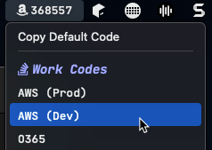
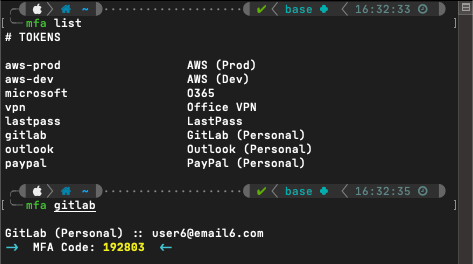

# xbar modules

This repository contains [xbar](https://github.com/matryer/xbar) modules. Scripts are self-documenting so please read carefully before making modifications. 

## Modules

### `mfa-codes.5s.sh`

 

``` bash
# Dependencies:
#   OATH-Toolkit (https://www.nongnu.org/oath-toolkit/)
#       brew install oath-toolkit

# Settings:
# 1. ENABLE_DEFAULT_CODE will cause your default MFA token to be displayed in the menu bar.
# 2. ENABLE_DEFAULT_COPY, if ENABLE_DEFAULT_CODE is ALSO true, will cause a "Copy Default Code" 
#    option to appear in the menu.
# 3. ONLY_ONE_GROUP changes the format of the output to a single list, ignoring group2 or any
#    other groups that have been added to the script.

# Other Notes:
# *  Tested and works well with Nerd Fonts. My preference is JetBrains Mono Nerd Font but this
#    can easily be changed to your own preference (https://www.nerdfonts.com/font-downloads)
# 
# *  If you wish to DISABLE the default code, consider changing the script name to only execute
#    every 1 day (1d). By default, the script assumes you will be displaying a default code and
#    therefore refreshes every 5 seconds (5s).
#
# *  Add your MFA codes to the variables below, taking care to separate the text label from the 
#    code value with a COLON (:). Separate each code on a new line and do not use COMMAS (,).
```

## MFA from Terminal
If you prefer to use the terminal instead of `xbar` for copying and pasting MFA codes:

* [OATH-Toolkit](https://www.nongnu.org/oath-toolkit/) is required. Install with `brew install oath-toolkit`.
* Save a file on your system named something like `.mfa-codes`. For the sake of example we'll say this is saved at `~/.mfa/.mfa-codes`. This file should contain information in the following order: 
    ```
    short-name, tab-character, mfa-code, tab-character, username (or email), tab-character, long-description, new-line
    ```
    The contents of the file should look something like this:
    ```
    # TOKENS

    aws-prod	ABC123ABC123ABC1	user@email.com	AWS (Prod)
    aws-dev	ABC123ABC123ABC1	user2@email2.com	AWS (Dev)
    microsoft	ABC123ABC123ABC1	user3@email3.com	O365
    vpn	ABC123ABC123ABC1	user4	Office VPN
    lastpass	ABC123ABC123ABC1	user5@email5.com	LastPass
    gitlab	ABC123ABC123ABC1	user6@email6.com	GitLab (Personal)
    outlook	ABC123ABC123ABC1	user7@outlook.com	Outlook (Personal)
    paypal	ABC123ABC123ABC1	user8@email8.com	PayPal (Personal)
    ```
* Add the following to your shell profile:
    ``` bash
    color_nocolor='\033[0m'
    color_yellow2='\033[1;93m'
    color_yellow_italic='\033[3;93m'
    color_cyan2='\033[1;36m'

    alias mfa="getMfaToken "

    getMfaToken() {
        tSource="$HOME/.mfa/.mfa-codes"

        if [[ "$1" == "list" ]]
        then
            awk -F\t '{printf("%-25s %-25s \n",$1,$4)}' $tSource
        else
            tString=$(grep "^$1\\t" "$tSource")

            if [ $? -eq 0 ]
            then
                tUser="$(echo $tString | awk -F\t '{print $3}')"
                tCode="$(echo $tString | awk -F\t '{print $2}')"
                tDesc="$(echo $tString | awk -F\t '{print $4}')"
                echo " "
                echo "$tDesc :: $tUser"
                tValue=$(oathtool -b --totp $tCode)
                echo -e "${color_cyan2}->${color_nocolor}  MFA Code: ${color_yellow2}$tValue ${color_nocolor} ${color_cyan2}<-${color_nocolor}"
                echo " "
                echo "$tValue" | pbcopy
            else
                echo "${color_yellow_italic}Code not found.${color_nocolor}"
            fi
        fi
    }
    ```
* Re-load terminal. After successfully retieving a code, the value will be copied to your system clipboard.
    