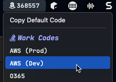

# Legacy MFA for macOS

## `mfa-codes.1d.sh`

 

### Dependencies
* [OATH-Toolkit](https://www.nongnu.org/oath-toolkit/) - `brew install oath-toolkit`

### Operational Settings
| Setting | Default | Note |
| ------- | ------- | ---- |
| `ENABLE_DEFAULT_CODE` | `false` | Causes the "default" code to be displayed in the menu bar. |
| `ENABLE_DEFAULT_COPY` | `true` | Adds a "Copy Default Code" option to the top of the menu. If set to false, only the code is displayed in the menu. |
| `ONLY_ONE_GROUP` | `false` | Causes all groups other than "group1" to be ignored. Heading name for Group 1 will not be displayed. |
| `ENABLE_SUBMENU` | `false` | Causes codes to be rolled-up under their group heading rather than displayed together in the top level of the menu. |

### Configuration Settings
| Setting | Note |
| ------- | ---- |
| `DEFAULT_NAME` | Relevant when `ENABLE_DEFAULT_CODE` is true. Displays a TOTP code directly in the top menu bar. |
| `DEFAULT_KEY` | Relevant when `ENABLE_DEFAULT_CODE` is true. Displays a TOTP code directly in the top menu bar. |
| `group1Name` / `group2Name` | Heading name for the group of codes. |
| `group1Color` / `group2Color` | Heading color for the group name. |
| `mfaGroup1` / `mfaGroup2` | Array of TOTP keys. Format is `<name>:<key>`. Values must be contained within double-quotes and do not separate with commas (`,`). |

### Notes
*  Tested and works well with Nerd Fonts. My preference is `JetBrains Mono Nerd Font` but this can easily be changed to your liking.
*  If you wish to ENABLE the default code, consider changing the script name to execute every five (5) or fewer seconds. By default, the script will not display a default code and therefore refreshes only once per day.
