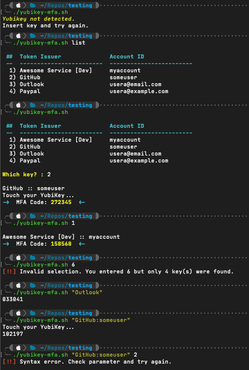

# Yubikey MFA via Terminal



This tool has four (4) modes of operation. It can be executed as a stand-alone script, or integrated into your shell profile. 
1. No parameter passed.
    * OATH keys will be read from Yubikey and you will be prompted to select the number of the key you want to capture. Code will be returned and its value copied to the macOS clipboard. 
2. Pass "list" as the only parameter.
    * OATH keys will be read from Yubikey. They will be numbered, but you will not be prompted to select a number, and no codes will be returned or copied to the clipboard.
3. Pass the number identifier for the key you're wanting.
    * The OATH code for the specified key will be returned and copied to macOS clipboard. 
4. Pass a string containing the name of the OATH key you're wanting.
    * If you provide a partial string, a match will be attempted but could fail if there are multiple possible selections each containing the string you provided. Potential matches will be returned allowing you to make a more specific request.
    * You can also choose to provide the entire Yubikey-Manager compliant string identifier: `<identity>:<account>`. This will always ensure a positive match if the key exists within the Yubikey you have inserted. 
    * Additional data about the OATH code is omitted from output - this means that only the OATH code itself is emitted and is therefore more suitable for use in programmatic applications.

## Dependencies
* [yubikey-manager](https://github.com/Yubico/yubikey-manager) - `brew install ykman`

## Operational Settings
| Setting | Default | Note |
| ------- | ------- | ---- |
| `ykPasswordRequired` | `false` | Change to `true` if your Yubikey has been configured to require a password for OATH use. When `true`, `ykPasswordString` must also be supplied for proper operation. |
| `ykPasswordString` | `some-password` | Required when `ykPasswordRequired` is `true`. This value is a plain-text string of your Yubikey OATH password. |
| `ykUseSerial` | `false` | Change to `true` to directly target a specific Yubikey if you have (or expect to have) multiple Yubikeys connected to your machine at one time. When `true`, `ykDevice` must also be supplied for proper operation. |
| `ykDevice` | `99999999` | Required when `ykUseSerial` is `true`. The Serial Number of the Yubikey you want the module to read from. |
| `ykMaxKeys` | `64` | Yubikey devices with firmware 5.7.x now support 64 OATH codes stored on-device (versus 32 previously). |

## Configuration Settings
No additional settings available.

## Notes
* If your Yubikey is not inserted when the script is executed, or if your key is not detected for any other reason, you may see the message "Yubikey not detected." 
* Tested and working with Yubikey OATH codes regardless of "touch" setting. If your code has been configured to require touch, prompts will appear on-screen as required and your Yubikey will begin to flash to indicate contact is required. Tap your key as usual and the value will be displayed on-screen and recorded to the macOS clipboard.
* If you have multiple keys loaded with very similar names, you may have to use the full OATH key name when attempting to retrieve codes by string rather than number identifier. Consider the following examples:

```
You have 3 OATH codes saved to your Yubikey with the following Issuer and Accounts:
* AWS [Prod]:usera@workemail.com
* AWS [Dev Root]:usera
* AWS [Personal]:usera@homeemail.com

You will have difficulty attempting to capture codes if all you are passing to the script is "AWS":

$ ./yubikey-mfa.sh "AWS"
Error: Multiple matches, please make the query more specific.

AWS [Prod]:usera@workemail.com
AWS [Dev Root]:usera
AWS [Personal]:usera@homeemail.com

This can be resolved by passing the full Issuer string:
$ ./yubikey-mfa.sh "AWS [Dev Root]"
```

```
You have 3 OATH codes saved to your Yubikey with the following Issuer and Accounts:
* AWS:usera@workemail.com
* AWS:usera
* AWS:usera@homeemail.com

$ ./yubikey-mfa.sh "AWS"
Error: Multiple matches, please make the query more specific.

AWS:usera@workemail.com
AWS:usera
AWS:usera@homeemail.com

In this scenario, the only resolution is to use the full OATH name as known to Yubikey:
$ ./yubikey-mfa.sh "AWS:usera@homeemail.com"
```

## Changes

### [1.0.1] - 2025-02-09

#### Added

* Support for multiple device handling and enabling selection of specific keys by serial number (`ykUseSerial` and `ykDevice`).
* Variable to support newer Yubikey's with increased OATH counts.

#### Changed

* Revised the `oath accounts list` and `oath accounts code` actions to be dynamically constructed vs using conditional logic.
