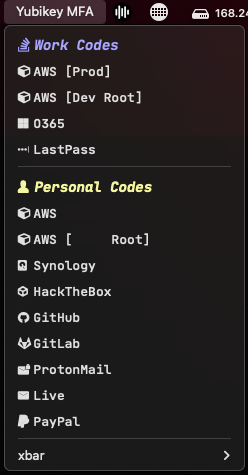
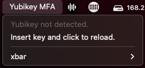

# Yubikey MFA for macOS

## `mfa-yubikey.1d.sh`

   

### Dependencies
* [yubikey-manager](https://github.com/Yubico/yubikey-manager) - `brew install ykman`

### Operational Settings
| Setting | Default | Note |
| ------- | ------- | ---- |
| `ykPassRequired` | `false` | Change to `true` if your Yubikey has been configured to require a password for OATH use. When `true`, `ykPassword` must also be supplied for proper operation. |
| `ykPassword` | `YUBIKEY-OATH-PASSWORD` | Required when `ykPassRequired` is `true`. This value is a plain-text string of your Yubikey OATH password. |
| `ykOrderOverride` | `false` | OATH codes are read from Yubikey and displayed in alphabetical order. To override this behavior, or to selectively group or omit codes, set value to `true`. When set to `true`, you must provide at minimum the values for all three `groupPrimary` settings (identified below). |
| `iconEnable` | `true` | Designed to be used in conjunction with [Nerd Fonts](https://www.nerdfonts.com/). If set to `true`, values specified in the `iconArray` will be used to "look up" which Nerd Font glyphs should be used with each OATH code from the Yubikey. |
| `groupSecondaryEnable` | `true` | Enable support for grouping Yubikey OATH keys in two groups. |

### Configuration Settings
| Setting | Note |
| ------- | ---- |
| `ykOathList` | Intentionally empty. Do not modify. |
| `groupPrimaryName` / `groupSecondaryName` | Heading name for groups of OATH codes. |
| `groupPrimaryColor` / `groupSecondaryColor` | Heading colors for groups of OATH codes. |
| `groupPrimaryList` / `groupSecondaryList` | Array of OATH keys. The format must match the output from Yubikey. To see which keys are available on your device, run `ykman oath accounts list`. Values must be contained within double-quotes and do not separate with commas (`,`). |
| `iconArray` | Used only if `iconEnable` is `true`. Array of labels paired with Nerd Font glyphs. Separate key/value with a colon (`:`), use double quotes (`"`), and do not separate value pairs with commas (`,`). If an OATH key is found that does not have a matching glyph, a circle and exclaimation glyph will display for that OATH entry. |

### Notes
* Tested with Nerd Fonts. My preference is `JetBrains Mono Nerd Font`, but this can easily be changed to your liking. See the `FONT` variable.
* If your Yubikey is not inserted when the `xbar` application loads, or if your key is not detected for any other reason, you may see a "Yubikey not detected" message. Insert your Yubikey and click the "reload" option to refresh the extension and read OATH codes from your device.
* Tested and working with Yubikey OATH codes regardless of "touch" setting. If your code has been configured to require touch, no additional prompts will display on-screen, but your Yubikey will begin to flash after clicking the name of the code you with you retrieve. Tap your key as usual and the value will be recorded to the macOS clipboard.
* If you're experiencing issues with dependencies not loading properly, check your `PATH` and modify the variable of the same name in the script. For Homebrew users, you could also consider adding the prefix to the script's path - for example: `PATH="/usr/local/bin:/usr/bin:$(brew --prefix)/bin"`
